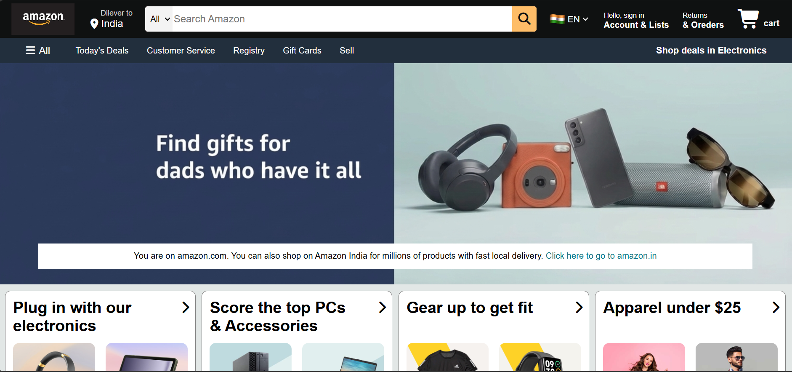
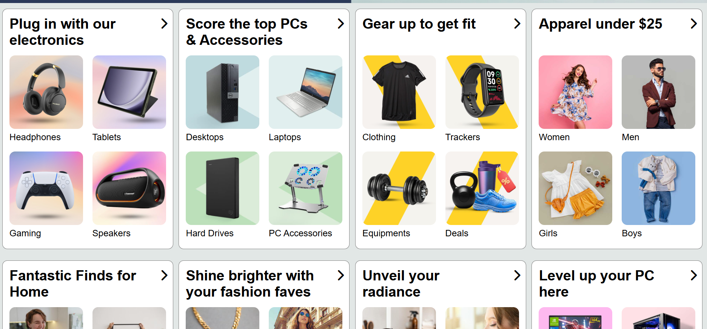
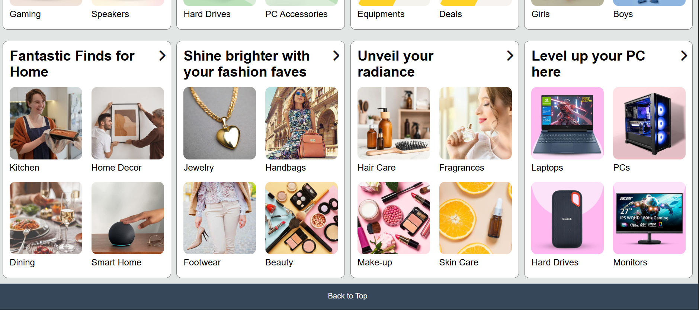
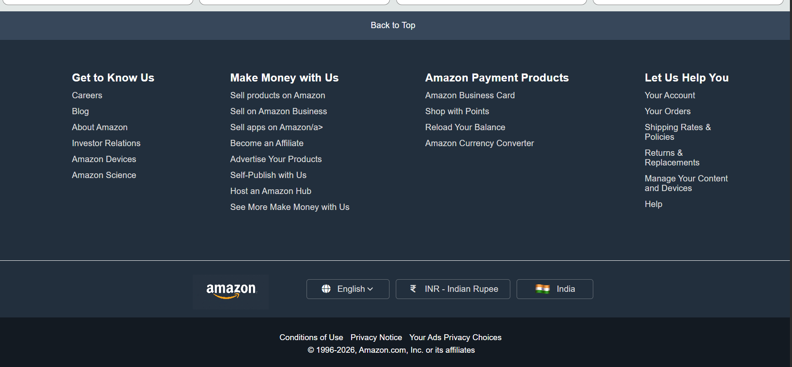

# amazon-homepage-clone

A frontend clone of the Amazon homepage built using HTML and CSS.

## Preview

### Homepage

### Product Sections

### Footer

## Features

- Amazon-style navigation bar and search section
- Hero/banner section
- Product and category cards
- Multiple product category sections
- Back-to-top navigation
- Multi-section footer with navigation links
- Language and currency selection UI

## Technologies Used

- HTML5
- CSS3

## Project Purpose

This project was built to practice frontend development concepts including
HTML structure, CSS layouts, positioning, styling, and component-like
section design.

## How to Run

1. Clone the repository.
2. Open the project folder.
3. Open `index.html` in a web browser.

## Disclaimer

This project is created for educational and practice purposes only.
It is not affiliated with or endorsed by Amazon.
